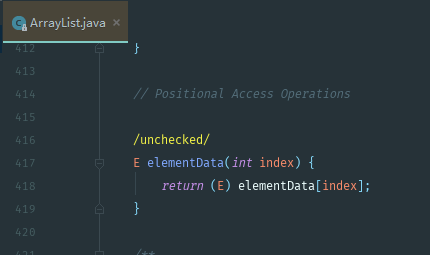

# 兼具静态编译的动态语言--Java
## Java泛型 和 C++模板(泛型) 

> 很大的一个题目, 其实是关于*Java泛型 以及与 C++模板(泛型)*的对比.

### Java泛型
#### 为什么要有'泛型'?
比如, 需要一个列表存数据, 如果没有泛型, 那, 每个类型都要有一个相应类型的列表的是实现. 会有诸如```IntegerList```, ```StringList```..., 再来一些自己写的类, 那代码量,,, 简直酸爽<br /> 
如果用 ```Object``` 存元素, 就会出现下面这种, 什么类型都能存进去, 到最后都不知道里面存的到底什么类型. 取一个就强转一次...
```java
List list = new ArrayList();

list.add(new Integer(2));
list.add("a String");

Integer integer = (Integer) list.get(0);

String string   = (String) list.get(1);
```
累不累, 取一次转一次, 还有维护一套每个元素的类型的列表, 编写和编译期都不能做类型检查, 这不就成了我大py吗? java的静态部分不就没意义了吗?

为了在**编译期规范和检查**, 就有了这种,
```java
List<String> strings = new ArrayList<String>();
strings.add("haha");
String first = strings.get(0);
```
通过显式的指明元素类型, 在编译期做一些检查, 并且由```ArrayList```做强转


将类型转换抽离出来, 并由编译器的检查确保类型可转换.

### 和C++的模板有什么区别

可以发现, 其实java的泛型是基于**万物Object**的, 也就是"类型消除"然后通过类型转换转过去. 并不会也不用产生新的代码, 全存```Object```然后```cast```. 有了Java泛型，我们可以做的事情也并没有真正改变多少；它只是让代码变得漂亮些。鉴于此，Java泛型有时也被成为”语法糖“。

而C++中并不是这样, 之所以叫模板, 是它确实是模板, 编译期会根据书写的类型, 编译器会针对每种类型创建一份模板代码的副本。, 以达到"书写五分钟, 编译两小时"的效果~~ 

可以用下面的代码展示一下效果:
```c++
#include <iostream>
using namespace std;

template<typename T>
class Obj{
public:
    static T m_t;
};

template<typename T>
T Obj<T>::m_t = 0;

int main(){
    Obj<int> i1,i2,i3;
    i1.m_t = 10;
    i2.m_t++;
    i3.m_t++;
    cout << Obj<int>::m_t<<endl;

    Obj<float> f1,f2,f3;
    f1.m_t = 20;
    f2.m_t++;
    f3.m_t++;
    cout << Obj<float>::m_t<<endl;
}  
```
会发现, 相同类型的```Obj<T>```使用相同的```static```
在Java中
```java
class Obj<T>{
    public static int m_t = 0;
}

public class JavaStudy {
    public static void main(String args[]) throws ClassNotFoundException {
        Obj<Integer> i1 = new Obj<Integer>();
        Obj<Integer> i2 = new Obj<Integer>();
        Obj<Integer> i3 = new Obj<Integer>();
        i1.m_t = 10;
        i2.m_t++;
        i3.m_t++;
        System.out.println(i3.m_t);
        Obj<Float> f1 = new Obj<Float>();
        Obj<Float> f2 = new Obj<Float>();
        Obj<Float> f3 = new Obj<Float>();
        f1.m_t = 20;
        f2.m_t++;
        f3.m_t++;
        System.out.println(f3.m_t);
        System.out.println(i3.m_t);
    }
}
```
会发现所有的```Obj<T>```共享一个```static```, 不管```T```是否相同.

**C++中```i1```和```f1```的类型不同, 而java中是相同的.**


## 总结一下:
1. C++模板可以使用int等基本数据类型。Java则不行，必须转而使用Integer(Object是引用, 不是基础数据类型)

2. Java中，可以将模板的类型参数限定为某种特定类型。例如，你可能会使用泛型实现Dota，并规定参数必须扩展自Dota2。
    ```java
    interface Dota{
        String dota();
    }
    class Dota2 implements Dota{
        public String dota(){
            return "Dota2";
        }
    }
    class Obj1<T extends Dota2>{
        public static int m_t = 0;
    }
    class Obj2<T extends Dota >{
    public static int m_t = 0;
    }
    ```
    **注:** 都是用的关键字```extends```.

3. C++中，类型参数可以实例化，Java不可以实例化

4. Java中，类型参数（即Obj<T>中的T）不能用于静态方法和变量，因为他们会被Obj<Integer>和Obj<Float>共享。但在C++中，这些类是不同的，类型参数可以用于静态方法和静态变量。

5. 在Java中，不管类型参数是什么，Obj的所有实例都是同一类型。类型参数(T)会在运行时被抹去。而C++中，参数类型(T)不同，实例类型也不同

-----------------------------
参考:
1. [Java泛型：泛型类、泛型接口和泛型方法](http://blog.csdn.net/thm521888/article/details/53155687)
2. [c++类模板遇上static关键字](http://blog.csdn.net/ydxlt/article/details/51111654)
3. [【C++, Java】C++模板和Java泛型之间有何不同？](http://blog.csdn.net/michellechouu/article/details/47044331)