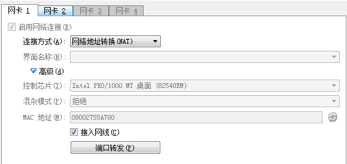
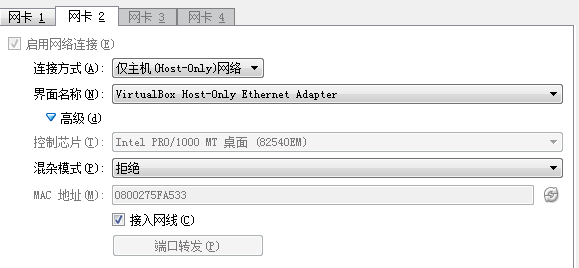
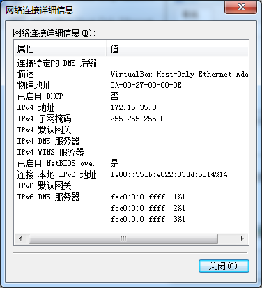
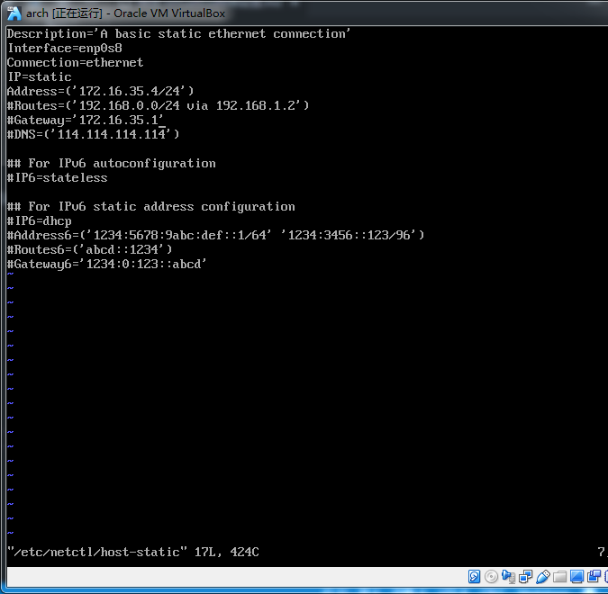
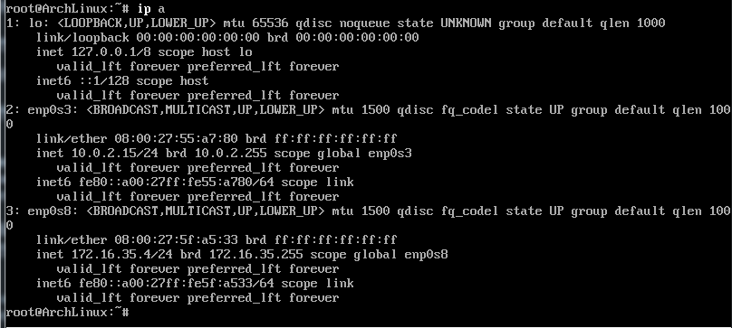
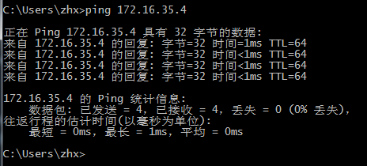
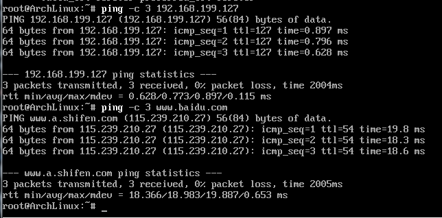

# 网络设计

windows环境，全默认安装完vbox，全默认安装arch后(默认单网卡,NAT模式)，



默认是能访问外网的，即
```ping www.baidu.com```是能ping通的, 


尝试ping宿主机也可行的, ```ping 192.168.199.127```(**注意宿主是C类私有, 后面用得到**)


执行```ip a``` 看到


在宿主机尝试 ```ping``` 这个IP


## **这自然是不行的, 这个IP就是私有网络的. 为了能让宿主ping通虚机, 给虚机加了另一块网卡**



这里只是选择了**仅主机(Host-only)网络**, 其他默认.

由于宿主机已经占用了C类私有,虚机占用了A类私有, 为了不冲突,将虚拟网卡ip设置为B类私有, 



再次开机arch, 发现能识别到, 但是还没有配置, 所以是```inactive```.


```
cp /etc/netctl/examples/ethernet-static /etc/netctl/host-static
vim /etc/netctl/host-static
```
这里选定新的网卡，然后配置静态IP， **不要设置网关**



然后启用该网卡
```
netctl enable host-static
netctl start host-static
```
通过 ```netctl status host-static```查看，发现是```active```


然后通过 ```ip a``` 查看， 可以发现网卡已经启用，并且拿到了第二个IP **172.16.35.4**



再次在宿主机执行ping



确认虚拟可访问外网，能访问宿主



-----------------------
**注意点：**

1. 如果宿主机已经在局域网中，注意虚拟机的新网卡ip段不要和宿主机冲突（这里是宿主C类，虚机B类）
2. 虚机新网卡配置时，不要设置网关，即便和宿主机对虚拟网卡的配置一样抑或网关设置成宿主机里虚拟网卡，否则不可联网。


--------------------------
参考：

1. [centos&Linux 双网卡双网关的配置方法详解](http://blog.csdn.net/tksnail/article/details/60865812)
2. [VirtualBox实现内外网络互访问的配置](https://www.cnblogs.com/cindyleo/p/5836732.html)
3. [在 VirtualBox 里安装 Arch Linux 操作系统](https://www.jianshu.com/p/98b8965b1d10)